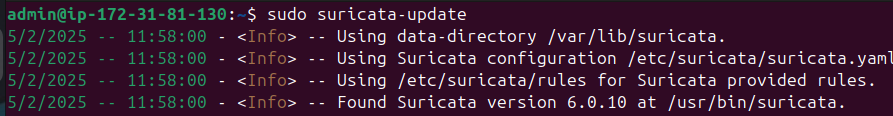
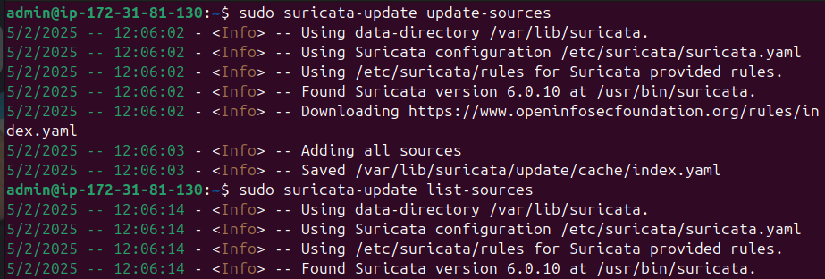

## Establecimiento y gestión de normas y notificaciones

Suricata emplea patrones para generar alertas, lo que requiere su instalación y actualización periódica. Estos patrones, también conocidos como reglas, explican el nombre de los archivos de reglas. Con la herramienta suricata-update, es posible buscar, actualizar y gestionar estas reglas para suministrarlas a Suricata.

Ejecutamos el modo predeterminado para obtener el conjunto de reglas de ET Open:
```
sudo suricata-update
```


Para mantener actualizadas las reglas de deccion haremos: 
```
sudo suricata-update update-sources

```
```
sudo suricata-update list-sources

```


Al hacer esto se habran instalado "/var/lib/suricata/rules" con un archivo "suricata.rules":
