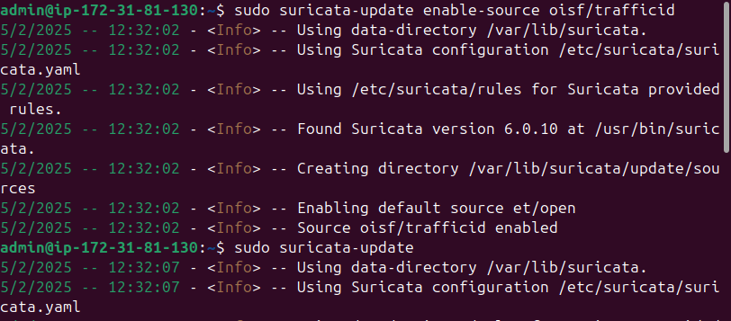

## Establecimiento y gestión de normas y notificaciones

Suricata emplea patrones para generar alertas, lo que requiere su instalación y actualización periódica. Estos patrones, también conocidos como reglas, explican el nombre de los archivos de reglas. Con la herramienta suricata-update, es posible buscar, actualizar y gestionar estas reglas para suministrarlas a Suricata.

Ejecutamos el modo predeterminado para obtener el conjunto de reglas de ET Open:
```
sudo suricata-update
```


Para mantener actualizadas las reglas de deccion haremos: 
```
sudo suricata-update update-sources

```
```
sudo suricata-update list-sources

```


Para habilitar un conjunto de reglas específico, como "oisf/trafficid":
```
sudo suricata-update enable-source oisf/trafficid
```
``` 
sudo suricata-update
```


Ahora, si queremos visualizar las fuentes habilitadas, debemos ejecutar el siguiente comando:
``` 
sudo suricata-update list-enabled-sources
```
```
sudo suricata-update enable-source ptresearch/attackdetection
```


Para ver las fuentes habilitadas:
```
sudo suricata-update list-enabled-sources
```


Por último, para guardar los cambios y obtener las reglas activadas:
```
sudo suricata-update
```


