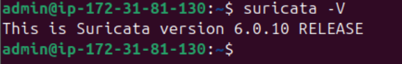

## Instalación

Antes de instalar, es recomendable actualizar:
```
sudo apt update 
```
```
sudo apt upgrade 
```
Posteriormente instalaremos el paquete con el que vamos a trabajar:
```
sudo apt install suricata -y 
```
Para verificar que se instaló correctamente y saber con que version estamos trabajando utilizaremos : 
```
suricata -V
```

```
sudo systemctl status suricata
```


## Configuración Básica 

Comprobación correcta de la ruta de logs
```
sudo nano /etc/suricata/suricata.yaml
```


Configuración de nuestra interfaz de red
```
af-packet:
    - interface: enp0s3
      cluster-id: 99
      cluster-type: cluster_flow
      defrag: yes
      use-mmap: yes
      tpacket-v3: yes
```
